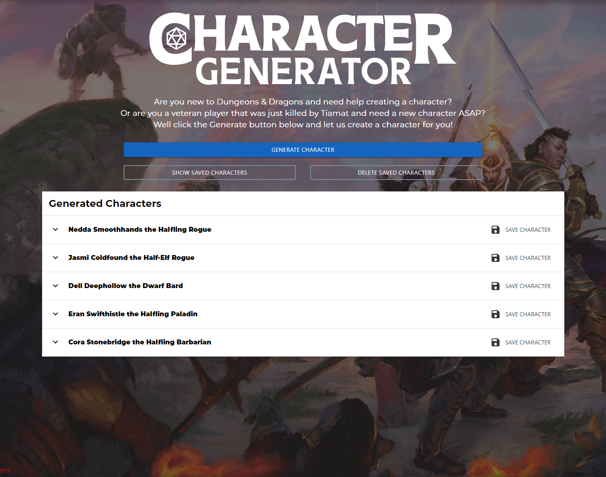

# Dungeons & Dragons Character Generator

## Table of Contents
* [Purpose](#purpose)
* [Demo](#demo)
* [Live Website](#website)
* [Built With](#built)
* [Contributers](#reflection)

----

## Purpose 
A tool to help new Dungeons & Dragons players create characters or help veteran players create a new character quickly.

----

## Demo 

---

## Live Website 

[Character Generator](https://einalem4.github.io/character-generator/)

----

## Built With 
* HTML
* CSS
* MaterilizeCSS
* JavaScript
* Serp API
* DnD5e API

----

## Contributers
* [Melanie Arnold](https://github.com/einalem4)
* [Rick Hill](https://github.com/rickhill543)
* [Ian Jackson](https://github.com/ijacksondesign)
* [Tyler Razer](https://github.com/thrazer675)